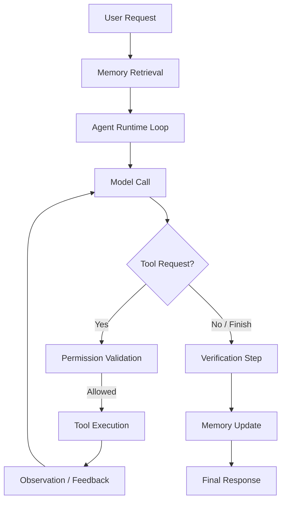

# LLMBrain Architecture

LLMBrain is a **memory-native terminal coding agent**. It is designed around a persistent repository intelligence layer that prevents the agent from repeatedly rediscovering architecture, symbols, decisions, commands, conventions, and prior task results across sessions.

## Core Layers

### 1. Persistent Repository Memory (Storage Layer)
- **SQLite Database (`brain.db`)**: Acts as the canonical storage for project metadata, scanned files, extraction chunks, facts, entities, and relations.
- **Task Memory Persistence**: Expanded to store task runs, decisions, command history, and failures/resolutions.
- **Incremental Indexing**: Uses document hashes to reuse cached facts/entities, minimizing duplicate LLM API costs.

### 2. Context Compiler (Token-compact Presentation)
- **BrainFrame Format (`brainframe.bf`)**: Rather than verbose JSON arrays, facts, entities, and relationships are serialized in custom compact tables, saving up to 80% of context tokens.
- **Selective Retrieval**: Dynamically queries the SQLite database based on:
  - Text relevance to the active request.
  - Recency (recent git changes).
  - Symbol relationships and dependency distance.
  - Prior task decisions.

### 3. Agent Runtime Loop (`llmbrain/agent/runtime.py`)
Orchestrates task execution through a provider-independent loop with features:
- **Bounded Iterations**: Safe execution limit (default 15 steps) to prevent infinite loops.
- **Structured Output**: Uses `generate_structured` with JSON schemas to constraint LLM decisions to a well-defined `thought` -> `tool_call` or `finish` structure.
- **Error Recovery**: Catching shell execution or tool errors and feeding them back to the agent as observations.
- **Logs**: Detailed task run logs saved under `.llmbrain/logs/tasks/<task_id>.json`.

### 4. Built-in Tools (`llmbrain/agent/tools.py`)
Provides secure, strongly-typed interfaces for agent activities:
- **File System**: `read_file`, `list_files`, `glob`, `grep`, `write_file`, `apply_patch` (unified diff).
- **Subprocesses & Testing**: `shell` commands (timeout bounded, output-size truncated), `run_tests` (auto-detects Pytest/Poetry/Nix).
- **Version Control**: `git_status`, `git_diff`, `git_log` for repository state tracking.
- **Auditing**: Every tool execution yields an `AuditRecord` tracking input, output size, permission levels, and duration.

### 5. Safety Manager (`llmbrain/agent/safety.py`)
Enforces permission limits depending on user settings:
- **`read-only`**: Blocks write and shell operations.
- **`ask-before-write`**: Prompts the user before write/shell/destructive tool runs.
- **`trusted-project`**: Autopermits writes, asks for shell/destructive commands.
- **`deny-shell`**: Disallows shell commands.
- **Path Traversal Protection**: Prevents reads/writes outside the project root path.
- **Destructive Commands Blocklist**: Flags history rewriting or force pushes.

### 6. Scaling & Observability Layer (Phase 6)
Ensures asynchronous, resource-aware processing on large repositories:
- **Async Indexing Job Queue (`llmbrain/core/queue.py`)**: An SQLite-persisted task queue supporting 5 priority levels (`JobPriority`) and concurrency locks. Handles background repository build triggers.
- **Resource Manager (`llmbrain/core/resource_manager.py`)**: Gathers real-time snapshots of system CPU and RAM load. Adaptively adjusts worker pool concurrency dynamically based on system stress.
- **Operation Profiler (`llmbrain/services/profiler.py`)**: Context manager that measures execution durations and virtual memory usage deltas (`VmRSS`) to track performance bottlenecks.
- **Service Monitoring API (`llmbrain/services/remote.py`)**: Performs automated endpoint checks using HTTP status and latency probes.

### 7. Semantic Search & Registry Layer (Phase 7)
Enables semantic discovery and multi-repository workspace support:
- **TfIdf Fallback Embedder (`llmbrain/services/embeddings.py`)**: Computes unit-normalized TF-IDF weight vectors of user-defined dimension sizes without any external deep learning dependencies.
- **SQLite Vector Store (`llmbrain/storage/vector_store.py`)**: Stores embedding float lists as serialized JSON arrays. Computes cosine similarity scores at SQLite load-time to return top-K similar items.
- **Multi-Repo Registry (`llmbrain/services/multi_repo.py`)**: Manages repository references from a centralized JSON registry (`~/.local/share/llmbrain/registry.json`), permitting multi-project search routing.
