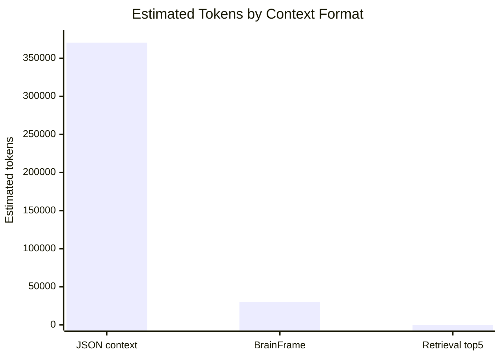

# LLM Brain

> RAG answers questions. **LLM Brain builds memory.**

Source-grounded engineering memory compiler for repositories, docs, incidents, ADRs, and security notes.

Traditional RAG retrieves relevant chunks for a question. LLM Brain compiles repositories and documentation into durable, auditable engineering memory: SQLite/JSONL storage, compact BrainFrame context, Markdown/MDX wiki pages, and graph knowledge maps.

[](https://github.com/Radeonares32/LLMBrain/actions/workflows/ci.yml)
[](pyproject.toml)
[](LICENSE)
[](pyproject.toml)

## Why LLM Brain?

*RAG is useful for retrieval. But engineering teams also need persistent memory.*

Turn any repository into source-grounded engineering memory. While standard Retrieval-Augmented Generation (RAG) tools fetch snippets to answer one-off questions, LLM Brain turns scattered knowledge into versioned, source-grounded artifacts.

That is why the project's philosophy is: **RAG answers questions. LLM Brain builds memory.**

### What it is
- A memory compiler for engineering teams.
- An automated pipeline that extracts facts, entities, and relations from code and docs.
- A knowledge graph generator.
- A secure redactor that protects your secrets before hitting an LLM.

### What it is not
- It is **not** a traditional RAG chatbot.
- It is **not** an AI auto-completion tool.
- It is **not** a generic documentation generator that hallucinates without evidence.

## Approach Comparison

| Approach          | Primary job                | Output                                 | Limitation                                       |
| ----------------- | -------------------------- | -------------------------------------- | ------------------------------------------------ |
| Traditional RAG   | Retrieve chunks            | Temporary context                      | Does not create durable memory                   |
| AI docs generator | Generate documentation     | Markdown/docs                          | Often lacks evidence and reproducibility         |
| **LLM Brain**     | Compile engineering memory | SQLite, JSONL, BrainFrame, Wiki, Graph | Designed for source-grounded knowledge workflows |

## Architecture

From codebase chaos to auditable knowledge, LLM Brain employs a structured pipeline:
1. **Scanner & Chunker**: Safely parses `.md`, `.py`, `.ts`, `Dockerfile`, etc., ignoring binaries and secrets.
2. **LLM Extraction**: Integrates via `openai`, `deepseek`, `anthropic`, or `ollama` to extract structured data via strict JSON Schemas.
3. **Security & Evidence Layer**: Automatically strips secrets and verifies that extracted facts actually exist in the cited source lines. Hallucinations are demoted in confidence.
4. **Storage Engine**: Persists data canonically in SQLite and exports as JSONL.
5. **Generators**: Compiles BrainFrame (`.bf`) token-efficient context, a markdown Wiki, and GraphML maps.

## Features

- **Evidence-first memory for software teams**: Every fact extracted is tied to a specific `path:Lstart-Lend`.
- **Secret Redaction**: Safely strips out API keys and tokens (e.g. AWS, OpenAI) before they leave your machine.
- **Hallucination Guard**: Automatically detects facts lacking source evidence and flags them.
- **CI/CD Ready**: Native GitHub Actions support to detect documentation drift and score PR risks.
- **Provider Agnostic**: Use Local LLMs or Cloud Providers seamlessly.

## Installation

Install the CLI tool via pip:

```bash
pip install llmbrain
```

For development installation:
```bash
git clone https://github.com/<owner>/llmbrain.git
cd llmbrain
pip install -e ".[dev,providers,web]"
```

## Quickstart

Build an auditable engineering memory for a project using a production LLM provider:

```bash
export DEEPSEEK_API_KEY=...
llmbrain build examples/sample-project --provider deepseek
```

Print the token-compact BrainFrame context:
```bash
llmbrain context examples/sample-project --print
```

Generate a knowledge graph:
```bash
llmbrain graph examples/sample-project --format json
```

Run CI checks on a project to detect drift and hallucinated evidence:
```bash
llmbrain ci examples/sample-project --fail-on high
```

## CLI Usage

LLM Brain is a CLI-first tool. Some of the core commands include:

- `llmbrain scan PATH`: Scans a directory and reports supported files.
- `llmbrain build PATH`: Runs the compilation pipeline.
- `llmbrain context PATH`: Outputs the generated `.bf` file.
- `llmbrain diff PATH`: Shows git diffs to track drift.
- `llmbrain health PATH`: Generates an evidence health score for the repository.
- `llmbrain token-report PATH`: Compares JSON-style context with BrainFrame context.
- `llmbrain serve`: Boots the FastAPI server for programmatic access.

Run `llmbrain --help` for a full list of commands and options.

## Incremental Builds

Cold builds can be expensive because source-grounded fact/entity extraction requires
many structured LLM calls. LLM Brain now supports incremental reuse by default:

- unchanged chunk facts are reused from previous JSONL artifacts,
- unchanged document entities are reused,
- no-change relation graphs are reused,
- changed files still flow through the normal provider + JSON Schema validation path.

Use `--full` to force a complete rebuild:

```bash
llmbrain build . --provider deepseek --full
```

## Benchmark Snapshot

The latest full-repository benchmark was run with **DeepSeek**. These numbers
should be read as DeepSeek-validated results; OpenAI, Anthropic, and Ollama may
work through their provider adapters, but this benchmark has not been verified
against those providers yet.

The result shows the intended split: BrainFrame is the compact LLM context, while
Markdown wiki and JSONL remain durable memory artifacts rather than prompt
payloads.



| Metric | Value |
| --- | ---: |
| Validated provider | DeepSeek |
| Other providers | Not benchmarked yet |
| Source estimate | 85,108 tokens |
| JSON-style context baseline | 370,501 tokens |
| BrainFrame context | 29,991 tokens |
| BrainFrame savings vs JSON | 91.91% |
| BrainFrame savings vs source | 64.78% |
| Retrieval top-5 context | 126 tokens |
| Retrieval top-5 savings vs source | 99.85% |
| No-change incremental build | 8.06s without API key |
| Evidence health | 100/100 |

## Agent-Friendly Development

LLM Brain includes agent-oriented project instructions:

- `CLAUDE.md` — coding-agent guidance for Claude/Cursor-style tools
- `AGENTS.md` — recommended agent roles and responsibilities
- `SKILLS.md` — modular capability map for LLM Brain skills

These files help AI coding agents preserve the project architecture,
evidence-first behavior, token-efficient BrainFrame context, and
mock/offline-compatible workflows.

## FastAPI Usage

LLM Brain can also be used programmatically or run as an API server:

```bash
llmbrain serve --host 0.0.0.0 --port 8000
```

Or via the Python API:

```python
from llmbrain.services.project_service import ProjectService

service = ProjectService()
result = service.build_project("examples/sample-project")
print(f"Compiled {result.document_count} documents.")
```

## Output Structure

Compiling a project produces source-grounded knowledge maps for modern codebases under the `.llmbrain/` directory:

```text
.llmbrain/
├── brain.db                 # Canonical SQLite storage
├── manifest.json            # Build run metadata
├── documents.jsonl          # Raw scanned documents
├── chunks.jsonl             # Extracted code chunks
├── facts.jsonl              # Extracted engineering facts
├── entities.jsonl           # Extracted entities
├── relations.jsonl          # Extracted relations
├── llm-context/
│   └── brainframe.bf        # Token-compact context for LLMs
├── schemas/                 # Strict JSON schemas used for extraction
├── graph/
│   ├── graph.json           # Knowledge Graph representation
│   └── graph.graphml        # GraphML format for visualization
└── wiki/                    # Generated Markdown Wiki
    ├── index.md
    └── project-overview.md
```

## Token-Efficient LLM Context

LLM Brain stores canonical data in SQLite and JSONL, but it does not send large JSON blobs to LLMs by default. For LLM context, it uses BrainFrame: a compact TOON/JTON-style table format designed to reduce repeated keys and preserve source evidence.

Use `llmbrain token-report PATH` to compare a JSON-style context baseline with the generated BrainFrame context.

## BrainFrame Example

`brainframe.bf` is our ultra-compact, token-efficient format designed specifically to feed LLMs maximum context with minimum overhead:

```text
@project sample-project
@project_id 1234abcd
@type engineering_knowledge_compiler

#entities
auth_service | service | AuthService | app/services/auth.py | high

#relations
main.py | uses | auth_service | app/main.py:L10-L12 | high

#facts
f1 | AuthService | handles | user login | app/services/auth.py:L5-L15 | high
```

## Security & Evidence Model

LLM Brain prioritizes security and truthfulness.
- **Redaction**: Secrets like `OPENAI_API_KEY=sk-...` are regex-matched and replaced with `[REDACTED_API_KEY]` entirely locally.
- **Evidence Verification**: All facts must point to a valid line range in a real file. Invalid pointers cause the fact's confidence score to drop to `weak` or `invalid`.

## CI/CD & GitHub Actions

You can integrate LLM Brain directly into your CI/CD pipelines to monitor drift between your code and your documentation. The `llmbrain ci` command will generate a `ci-result.json` and fail the build if high-risk regressions are detected.

Example GitHub Action (`.github/workflows/llmbrain-ci.yml`):
```yaml
name: LLM Brain CI
on: [pull_request]
jobs:
  check-drift:
    runs-on: ubuntu-latest
    env:
      DEEPSEEK_API_KEY: ${{ secrets.DEEPSEEK_API_KEY }}
    steps:
      - uses: actions/checkout@v6
      - run: pip install llmbrain
      - run: llmbrain ci . --provider deepseek --fail-on high
```

## LLM Providers

LLM Brain supports multiple providers via the `--provider` flag:
- `openai`: Requires `OPENAI_API_KEY`.
- `deepseek`: Requires `DEEPSEEK_API_KEY`.
- `anthropic`: Requires `ANTHROPIC_API_KEY`.
- `ollama`: Requires `OLLAMA_MODEL` and a running Ollama server.

## Roadmap
See [ROADMAP.md](ROADMAP.md) for planned features, including full SaaS integration and advanced Web UIs.

## Contributing
We welcome contributions! Please see [CONTRIBUTING.md](CONTRIBUTING.md) and our [CODE_OF_CONDUCT.md](CODE_OF_CONDUCT.md).

## License
MIT License. See [LICENSE](LICENSE) for details.

---

If your team needs more than chat over files, LLM Brain is built for that.

**RAG answers questions. LLM Brain builds memory.**
