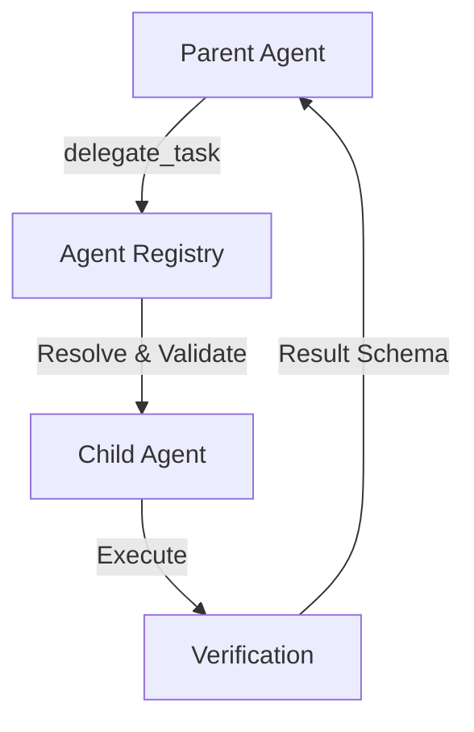

# Agent Delegation

LLMBrain supports bounded task delegation between specialized agents. This document describes the security and orchestration policies governing delegation.

## Delegation Rules

1. **No Permission Escalation**: A child agent cannot have higher privileges than its parent. For example, a `read-only` agent cannot delegate a task to a `ask-before-write` child with write access.
2. **No Scope Expansion**: A child agent inherits task-path restrictions from the parent. It cannot access workspace files outside the parent's allowed paths.
3. **No Prohibited Tools**: Denied tools from the parent are also forbidden for the child.
4. **Depth and Iteration Ceilings**: Delegation chain depth is strictly capped by the parent's configured limits (`max_delegations`).
5. **Loop Detection**: The parent chain is verified at the entry point of task execution to prevent recursive delegation cycles.

## Delegation Flow Diagram

